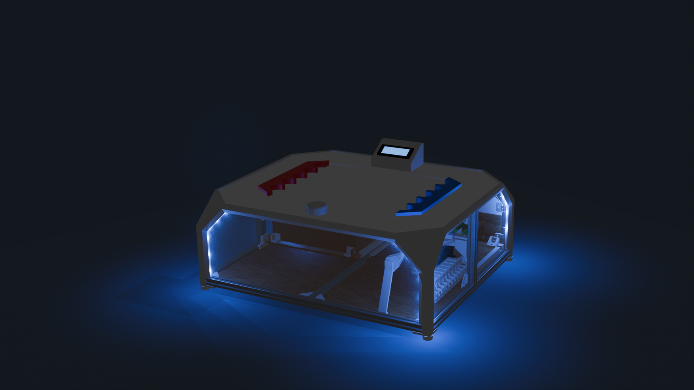

# Tapatan

<figure>
   
</figure>


## Inhaltsverzeichnis
- [Über das Projekt](#über-das-projekt)
- [Ziele](#ziele)
- [Verwendung / Anleitung](#verwendung-anleitung)
- [Technische Umsetzung](#technische-umsetzung)
- [Mitwirkende](#mitwirkende)
- [Kontakt](#kontakt)

<a name="über-das-projekt"/>

## Über das Projekt
Im Rahmen eines Projekts im 5. Semester des trinationalen Studiengangs Mechatronik bestand unsere Aufgabe darin, ein bestehendes Projekt unserer Vorgänger zu analysieren und zu verbessern. Dabei haben wir die Spiele Tapatan und Tic-Tac-Toe mechatronisch umgesetzt.

<a name="ziele"/>

## Ziele
Unser Ziel war es, den bestehenden Programmcode und die Mechanik grundlegend zu überarbeiten und zu optimieren. Die wichtigsten Änderungen und Erweiterungen umfassen:

### Software-Ziele:
- Implementierung des Spiels Tic-Tac-Toe als zusätzliche Spielvariante.
- Neuentwicklung des Algorithmus zur Zugberechnung des Computers für das Spiel Tapatan, um sowohl die Rechenzeit zu verkürzen als auch ein intelligenteres Verhalten zu erreichen.
- Integration eines Player-vs.-Player-Modus in beiden Spielvarianten.
- Einführung von drei Schwierigkeitsstufen für beide Spiele.
- Optimierung der Motorsteuerung zur Minimierung von Vibrationen.

### Mechanische Ziele:
- Überarbeitung des Gantry-Systems, um eine vibrationsfreie Bewegung zu gewährleisten und mechanische Überbestimmungen zu vermeiden.
- Neugestaltung des Gehäuses für ein ansprechenderes Design.
- Einbau von Stauraum zur Aufbewahrung der Spielfiguren und des Netzteilkabels.
- Verbesserung der Zugänglichkeit von Elektronik und Mikrocontroller-Anschlüssen zur Erleichterung von Wartung und Reparaturen.

### Elektronik-Ziele:
- Entwicklung einer Platine (PCB), um die Anzahl der Kabel zu reduzieren und die Übersichtlichkeit zu erhöhen.
- Integration der Verkabelung in die Mechanik, um eine saubere und geordnete Kabelführung zu gewährleisten.

<a name="verwendung-anleitung"/>

## Verwendung / Anleitung

### Spielvorbereitung
1. Stelle die Spielfiguren auf ihre Plätze.
2. Ziehe die Schublade mit den Spielfiguren heraus um an das rote Teil zu gelangen (siehe Abbildung 1 / Abbildung 2).
3. Spanne den Riemen in dem du am roten Teil drehst (siehe Abbildung 1/Abbildung 2). <br>
   Hinweis: Entspanne nach dem Spielen den Riemen wieder, um die Lebensdauer des Mechanismus zu verlängern und Schäden durch anhaltende Spannung zu vermeiden.
5. Stecke das Netzteilkabel ein.
6. Schalte den Schalter auf der Rückseite des Spiels ein.
7. Reinigung der Spieloberfläche

<figure>
   
   <figcaption><p><i>Abbildung 1: Riemenspannen Mechanismus</i></p></figcaption>
</figure> <br>

<figure>
   
   <figcaption><p><i>Abbildung 2: Riemenspannen Mechanismus</i></p></figcaption>
</figure>

### Spielmodis
Folgende Spielmodis können ausgewählt werden:
<figure>
   
   <figurecaption><p><i>Abbildung 3: Spielmodis</i></p></figurecaption>
</figure>


### Tic-Tac-Toe
Die Spieler setzen abwechselnd ihre Figuren auf das Spielfeld (es wird jeweils angezeigt, wer am Zug ist). <br>
Die einzige Voraussetzung hierbei ist, dass der Spieler die Steine in vertikaler Richtung (von oben nach unten) ausspielt.
Das Spiel endet, wenn ein Spieler drei Figuren in einer horizontalen, vertikalen oder diagonalen Reihe platziert hat. Ebenso endet das Spiel, wenn alle Felder belegt sind (Unentschieden). <br>
Hinweis: Das Spiel zeigt automatisch den Gewinner oder ein Unentschieden an. <br>

### Tapatan
Die Spieler setzen abwechselnd ihre Figuren auf das Spielfeld, bis beide Spieler jeweils drei Figuren platziert haben (es wird angezeigt, welcher Spieler am Zug ist). <br>
Die einzige Voraussetzung hierbei ist, dass der Spieler die Steine in vertikaler Richtung (von oben nach unten) ausspielt.
Sobald alle Figuren gesetzt sind, können diese bewegt werden. Die Figuren dürfen horizontal, vertikal oder diagonal verschoben werden. Hinweis: In dieser Version können die Figuren in alle diagonalen Richtungen bewegt werden, was die Komplexität des Spiels erhöht (siehe Abbildung 4). <br>
Das Spiel endet, wenn ein Spieler drei Figuren in einer horizontalen, vertikalen oder diagonalen Reihe platziert hat. <br>
Hinweis: Das Spiel zeigt automatisch den Gewinner oder ein Unentschieden an.<br>
<figure>
   
   <figurecaption><p><i>Abbildung 4: Spielfeld Tapatan</i></p></figurecaption>
</figure>

<a name="technische-umsetzung"/>

## Technische Umsetzung

### Funktionsweise

#### Erkennen der Spielfiguren
Um auszuwerten, welche Spielfiguren auf welchem Feld stehen, wurde in jede Spielfigur ein Magnet integriert. Die beiden unterschiedlichen Farben (Rot und Blau) besitzen jeweils entgegengesetzt ausgerichtete Magnete. Dadurch erzeugen die verschiedenen Spielsteine unterschiedliche Magnetfelder an ihrer Unterseite. Mithilfe bipolarer Hallsensoren können diese Magnetfelder erkannt werden. Die Hallsensoren sind direkt unter der Spielplatte angebracht, sodass für jedes Feld ermittelt werden kann, ob es leer ist oder ein blauer bzw. roter Spielstein darauf platziert wurde. <br>

Um zu verhindern, dass sich die Spielsteine gegenseitig anziehen oder abstossen, wurde zusätzlich ein Stahlring um den Magneten in den Figuren integriert. Dieser beeinflusst das Magnetfeld so, dass es in radialer Richtung abgeschirmt wird und hauptsächlich in axialer Richtung wirkt.<br>

#### Verschieben der Spielfiguren
Die Spielfiguren werden mithilfe eines Elektromagneten bewegt, der sich unterhalb der Spielplatte befindet und durch das Gantry-System positioniert wird. Die Magnete in den Spielfiguren werden vom Elektromagneten angezogen, sodass die Figuren präzise und kontrolliert über das Spielfeld verschoben werden können.

<figure>
   
   <figurecaption><p><i>Abbildung 5: Aufbau</i></p></figurecaption>
</figure>

#### Gantry
Das Gantry-System basiert auf dem Prinzip eines H-Gantry (siehe Abbildung 6). Bewegen sich die beiden Motoren in die gleiche Richtung, verschiebt sich der Wagen, auf dem sich der Elektromagnet befindet, entlang der Y-Achse. Drehen sich die Motoren hingegen in entgegengesetzte Richtungen, bewegt sich der Wagen entlang der X-Achse. Dieses System ermöglicht eine präzise und stabile Positionierung der Spielfiguren.
<figure>
   
   <figurecaption><p><i>Abbildung 6: H-Gantry, Quelle: https://www.galil.com/news/whats-new-galil/white-paper-introducing-galils-new-h-bot-firmware </i></p></figurecaption>
</figure>

<figure>
   
   <figurecaption><p><i>Abbildung 7: H-Gantry Tapatan</i></p></figurecaption>
</figure>

### Elektronik

Dieses Projekt verwendet zwei speziell entwickelte Leiterplatten, um eine übersichtliche Verkabelung zu gewährleisten. Alle zugehörigen Dateien (z.B. Schaltpläne, Layout-Dateien) befinden sich in diesem Repository unter dem Ordner Schaltpläne. Hierfür wurde KiCad 8.0 verwendet mit dem Plugin "Interactive Html Bom" und der Bibliothek  "KiCad Library for Arduino Modules"

#### Versionen
**Version 1:**  Erste Version der Leiterplatten. Diese Version enthält einige Fehler, die manuell korrigiert werden konnten. **Diese Version sollte nicht mehr verwendet werden.**

**Version 2:** Überarbeitete Version der Leiterplatten.  Die folgenden Fehler wurden behoben:

* **Korrektur des Footprints der MOSFETs:**  Die MOSFETs, welche die LEDs ansteuern, haben nun den korrekten Footprint.
* **Hinzufügen von Zehnerdioden:**  Um einen Rückstrom vom Elektromagneten zu verhindern, der einen Reset des Arduinos ausgelösst hat, wurden zwei Zehnerdioden parallel hinzugefügt.
* **Änderung der Pinbelegung:** Die Pinbelegung wurde angepasst, um die Interrupt-Pins für den Rotary Switch nutzen zu können. 

**Bei einer erneuten Bestellung der Leiterplatten bitte unbedingt die Version 2 verwenden.**

**Hinweis:** Die Änderung der Pinbelegung (für die Interrupt-Pins am Rotary Switch) wurde bereits bei der Verkabelung der ersten Version manuell vorgenommen und der Code entsprechend angepasst.


#### Beschreibung der Leiterplatten

**Leiterplatte 1:** 

* Shield für den Arduino MEGA
* Ansteuerung des Elektromagneten
* Ansteuerung der LEDs
* Stromverteilung
* RESET Knopf
* POWER LED (GREEN)
* RX0, TX0, RX1, TX1 LEDs (YELLOW)
* Relais Status LEDs (RED)

<figure>
   
   <figurecaption><p><i>Abbildung 8: Leiterplatte 1</i></p></figurecaption>
</figure>

**Leiterplatte 2:**

* Verteilungsplatine für den Deckel
* Anschluss für Sensoren, LEDs, LCD-Display, Rotary-Switch

<figure>
   
   <figurecaption><p><i>Abbildung 9: Leiterplatte 2</i></p></figurecaption>
</figure>

#### Verkabelung
Die Verkabelung kann in den Schaltplänen eingesehen werden. Jede Version besitzt 3 Schaltpläne. Einen für das Gesammte Projekt und jeweils einen pro Leiterplatte.
Die Stromversorgung erfolgt über das Netzteil und die Buchse. Vcc wird über den Kippschalter(an/aus) geführt und im Anschluss auf die DC-DC Converter und direkt an der 1 Leiterplatte angeschlossen. Somit wird die 5V, 9V und 12V Spannungsversorgung sichergestellt.

**Abweichungen von Version 1 zur Abgabe:** 
Folgende Änderungen wurden vorgenommen aufgrund diverser Umstände
* Endschalter_Y ist an Pin D17 angeschlossen (Pin D9 defekt)
* Rotary_Switch_Digital_3 ist an Pin D2 angeschlossen
* M1_PUL ist an Pin D23 angeschlossen

#### Bestellung der Leiterplatten
Die Leiterplatten wurden bei JLCPCB bestellt.

#### Farbcode Verkabelung
| Farbe | Signal |
| ----- | ------ |
| Rot | VCC |
| Schwarz | GND |
| Blau | Elektromagnet |
| Weiss | Signal |

### Programmcode

#### Code Aufbau
Der Programmcode für den Arduino Mega wurde in Visual Studio Code mithilfe der PlatformIO IDE Extension entwickelt.

Für eine bessere Übersicht wurde der Code modularisiert und in mehrere Header-Dateien aufgeteilt, die sich im Ordner `include` befinden:
- `display.h`
- `game_logic.h`
- `input.h`
- `struct.h`
- `tapatan.h`
- `tictactoe.h`
- `MotorController.h`
- `led.h`

Die Hauptprogrammlogik sowie die Implementierung der `MotorController`- und `LED`-Klassen befinden sich im Ordner `src`. Für die Steuerung der Motoren und des LED-Streifens wurde jeweils eine eigene Klasse definiert. Diese Struktur vereinfacht die Handhabung im Programmcode, da keine unnötige Weitergabe oder Definition globaler Variablen erforderlich ist.

- `main.cpp`
- `MotorController.cpp`
- `led.cpp`

#### Code-Inhalt der verschiedenen Dateien  
Die verschiedenen Dateien haben jeweils folgende Funktionen:  

| **Dateiname**         | **Funktion**                                                                                       |  
|-----------------------|---------------------------------------------------------------------------------------------------|  
| `display.h`          | Funktionen zur Anzeige von Texten und Spielfeldern auf dem LCD-Display.                            |  
| `game_logic.h`       | Funktionen für die Spiellogik beider Spiele (TicTacToe und Tapatan).                                |  
| `input.h`            | Funktionen zum Auslesen der Sensoren (z. B. Hallsensoren und Rotary Encoder).                       |  
| `struct.h`           | Definition von Konstanten, Datenstrukturen und Spielparametern.                                     |  
| `tapatan.h`          | Funktionen für das Spiel Tapatan, einschließlich Spiellogik, Spielerinteraktion und Steuerung (LED, LCD, Motoren). |  
| `tictactoe.h`        | Funktionen für das Spiel TicTacToe, einschließlich Spiellogik, Spielerinteraktion und Steuerung (LED, LCD, Motoren). |  
| `MotorController.h`  | Deklaration der `MotorController`-Klasse zur Steuerung der Motoren.                                 |  
| `led.h`              | Deklaration der `LED`-Klasse zur Steuerung der LEDs.                                               |  
| `main.cpp`           | Funktionen für die Spielauswahl sowie die Initialisierung und das Zurücksetzen des Spielfelds.      |  
| `MotorController.cpp`| Implementierung der Methoden der `MotorController`-Klasse.                                         |  
| `led.cpp`            | Implementierung der Methoden der `LED`-Klasse.                                                     |  


#### Spielfeld
Das Spielfeld ist gemäss der folgenden Abbildung aufgebaut.
Die Angaben für die Spielsteinpositionierung der Steine können im strcut.h File angepasst werden.


<figurecaption><p><i>Abbildung 10: Spielfeld</i></p></figurecaption>

#### Spieler- / Computer-Zug
Der Code ist folgendermassen aufgebaut. Nachdem der Spieler ein Spielmodus inkl. Schwiergikeit ausgewählt hat, fängt im Modus PvC zufällig entweder der Computer oder der Spieler an. Das Spiel ist Zugbasiert und entprechend gibt es einen Spieler und einen Computerzug. Beim TicaTacToe ist das für das Setzen und beim Tapatan für das Setzen und anschliessende Verschieben.

##### Spielerzug
Sobald eine Änderung auf dem Spielfeld registriert wurde, wird überprüft, ob dieser Zug eine gültige Bewegung darstellt. Ist dies nicht der Fall, wird in der Funktion `handleIllegalMove` so lange gewartet, bis das ursprüngliche Spielfeld wiederhergestellt ist. Diese Logik entspricht der Funktion für den Spielzug beim Verschieben, mit dem Unterschied, dass hier andere Regeln gelten.

```cpp
// Funktion für das Platzieren eines Spielsteins durch den Spieler
bool playerPlaces(LiquidCrystal_I2C &lcd, GameSettings gameSettings, int Board[3][3], int BoardMemory[3][3], int currentPlayer, const int potPins[]) {
  bool turnOver = false;
    
  if (hasBoardChanged(Board, BoardMemory)) {
    if (isValidMove(Board, BoardMemory, currentPlayer)) {
      displayBoard(lcd, Board);
      turnOver = true;
    } else {
      handleIllegalMove(lcd, Board, BoardMemory, potPins, gameSettings, currentPlayer);
    }
  }
  return turnOver;
}
```

##### Computerzug:
Der Zug des Computers hängt vom gewählten Schwierigkeitsgrad ab. Im Schwierigkeitsmodus "Einfach" wird beim TicTacToe zufällig ein Stein auf eine leere Stelle platziert. Im Schwierigkeitsmodus "Mittel" wird ab dem dritten Zug der bestmögliche Zug ermittelt, bis dahin werden weiterhin zufällige Züge gemacht. Im Schwierigkeitsmodus "Schwer" werden nur die bestmöglichen Züge vom Computer gemacht (ein Sieg gegen den Computer ist unmöglich). Die Schwierigkeitsgrade im Spiel Tapatan sind ähnlich aufgebaut, mit dem einzigen Unterschied, dass im Modus "Mittel" beim Verschieben der Steine abwechselnd ein zufälliger und dann der bestmögliche Zug gemacht wird. Der bestmögliche Zug wird über den Minimax-Algorithmus mit Alpha-Beta Pruning ermittelt. Für das Platzieren und das Verschieben wurde jeweils eine Funktion für die Züge und den Minimax-Algorithmus geschrieben. 

```cpp
switch (gameSettings.difficulty) {              // Schwierigkeitsgrad des Computers
   case Schwer:
      makeBestMove(BoardDisplay);               // Besten Zug für den Computer bestimmen
      break;
   case Mittel:
      if (turnCount >= 3) {
            makeBestMove(BoardDisplay);         // Besten Zug für den Computer bestimmen
      } else {
            makeRandomMove(BoardDisplay);       // Zufälligen Zug für den Computer bestimmen
      }
      break;
   default:
      makeRandomMove(BoardDisplay);             // Zufälligen Zug für den Computer bestimmen
      break;
}
```

#### Minimax-Algorithmus mit Alpha-Beta Pruning

Der **Minimax-Algorithmus** ist ein rekursiver Entscheidungsalgorithmus, der in Zwei-Spieler-Spielen wie Tic-Tac-Toe verwendet wird, um den optimalen Zug zu finden. Der Algorithmus geht davon aus, dass beide Spieler optimal spielen. Er untersucht alle möglichen Züge und bewertet sie, indem er den besten Zug für den Computer maximiert und gleichzeitig den besten Zug des Spielers minimiert.

##### Alpha-Beta-Pruning

**Alpha-Beta-Pruning** ist eine Optimierung des Minimax-Algorithmus, die dazu beiträgt, unnötige Berechnungen zu vermeiden. Der Algorithmus schneidet Teile des Entscheidungsbaums ab, wenn er bereits einen besseren Zug gefunden hat. Dadurch wird die Effizienz des Algorithmus erheblich verbessert, da nicht jeder mögliche Zug vollständig untersucht werden muss.

- **Alpha**: Der beste Wert, den der maximierende Spieler finden kann.
- **Beta**: Der beste Wert, den der minimierende Spieler finden kann.

Wenn der Wert von **Beta** kleiner oder gleich **Alpha** wird, wird der aktuelle Zweig des Entscheidungsbaums abgeschnitten, da der Gegner bereits einen besseren Zug hat.

##### Code-Implementierung

Der folgende Code zeigt, wie der Minimax-Algorithmus mit Alpha-Beta-Pruning für ein Tic-Tac-Toe-Spiel implementiert wird:

```cpp
// Funktion zur Generierung aller möglichen nächsten Zustände
void getChildren(int Board[3][3], int children[9][3][3], BoardField moves[9], int &numChildren, bool maximizingPlayer) {
  numChildren = 0;
  for (int i = 0; i < 3; i++) {
    for (int j = 0; j < 3; j++) {
      if (Board[i][j] == 0) {
        // Kopiere das aktuelle Board
        copyBoard(Board, children[numChildren]);
        // Setze den Zug
        children[numChildren][i][j] = maximizingPlayer ? 1 : 2;
        // Speichere den Zug
        moves[numChildren].row = i;
        moves[numChildren].col = j;
        numChildren++;
      }
    }
  }
}

// Minimax-Algorithmus mit Alpha-Beta-Pruning
int minimax(int Board[3][3], int depth, int alpha, int beta, bool maximizingPlayer, BoardField &bestMove) {
  if (depth == 0 || isGameOver(Board)) {
    return evaluateBoard(Board);
  }

  if (maximizingPlayer) {
    int maxEval = INT_MIN;
    BoardField currentMove;
    int children[9][3][3];
    BoardField moves[9];
    int numChildren;
    getChildren(Board, children, moves, numChildren, true);
    for (int i = 0; i < numChildren; i++) {
      int eval = minimax(children[i], depth - 1, alpha, beta, false, currentMove);
      if (eval > maxEval) {
        maxEval = eval;
        bestMove = moves[i];           // Speichere die tatsächliche Position
      }
      alpha = max(alpha, eval);
      if (beta <= alpha) {
        break;
      }
    }
    return maxEval;
  } else {
    int minEval = INT_MAX;
    BoardField currentMove;
    int children[9][3][3];
    BoardField moves[9];
    int numChildren;
    getChildren(Board, children, moves, numChildren, false);
    for (int i = 0; i < numChildren; i++) {
      int eval = minimax(children[i], depth - 1, alpha, beta, true, currentMove);
      if (eval < minEval) {
        minEval = eval;
        bestMove = moves[i];           // Speichere die tatsächliche Position
      }
      beta = min(beta, eval);
      if (beta <= alpha) {
        break;
      }
    }
    return minEval;
  }
}
```

##### `getChildren`:
Diese Funktion generiert alle möglichen Züge basierend auf dem aktuellen Spielzustand. Es wird überprüft, welche Felder leer sind, und die möglichen Züge für den maximierenden oder minimierenden Spieler werden hinzugefügt.

##### `minimax`:
Der Minimax-Algorithmus bewertet rekursiv alle möglichen Züge. Alpha-Beta-Pruning wird verwendet, um nicht notwendige Züge zu ignorieren, wenn bereits ein besserer Zug gefunden wurde. Die Funktion gibt den besten Zug für den aktuellen Spieler zurück.

##### Visualisierung des Entscheidungsbaums:
Der Entscheidungsbaum für das Spiel könnte wie folgt aussehen:


<figurecaption><p><i>Abbildung 11: Visualisierung Entscheidungsbaum</i></p></figurecaption>

In diesem Beispiel stellt jeder Knoten einen möglichen Spielzustand dar, und die Kanten zwischen den Knoten repräsentieren mögliche Züge. Durch Alpha-Beta-Pruning wird ein Teil des Baums abgeschnitten, wenn ein besserer Wert bereits gefunden wurde.

#### Bewegung des Steins:
Nach der Berechnung des Computerzugs wird das Spielfeld gespeichert und mit dem aktuellen Spielfeld verglichen. Der Unterschied zwischen den beiden Spielfeldern entscheidet über die Start- und Zielposition der Verschiebung. Die Bewegung von Punkt A zu Punkt B erfolgt hierbei ausschließlich entlang der horizontalen und vertikalen Bahnen. Dasselbe erfolgt nach dem Spiel, beim Aufräumen des Spielfelds.

Der folgende Code zeigt, wie die Start- und Zielposition beim Platzieren eines neuen Steins ermittelt wird. Die Koordinaten werden anschliessend an die Bewegungsfunktion `moveStone` weitergegeben, die zudem den Elektromagneten steuert.

```cpp
// Funktion für das Ermitteln der Start und Zielposition der Motorbewegung (Platzierung der Spielsteine)
Move determineMoveToPlace(int Board[3][3], int BoardMemory[3][3], int garageState[2][5], MotorConfig config) {
  Move move;

  // Ermitteln der Startposition / Besetzer Stein in der Garage
  int garagePosition = findGaragestate(garageState[0], 1);
  move.startX = config.computerGaragePosition[garagePosition][0];
  move.startY = config.computerGaragePosition[garagePosition][1];

  // Leeren der Garage
  garageState[0][garagePosition] = 0;
  
  // Ermitteln der Zielposition
  BoardField targetField = getChangedField(Board, BoardMemory);
  move.targetX = config.boardPosition[targetField.row][targetField.col][0];
  move.targetY = config.boardPosition[targetField.row][targetField.col][1];
  return move;
}
```


### Stückliste

<a name="tapatanstk"/>

Tapatan:

| Teileart  | Teilename                           | Herstellung | Material | Anzahl |
| --------- | ----------------------------------- | ----------- | -------: | -----: |
| Baugruppe | [HGantry](#hgantry)                 |             |          | 1      |
| Baugruppe | [ElectronicPlate](#electronicplate) |             |          | 1      |
| Baugruppe | [Steineschublade](#steineschublade) |             |          | 1      |
| Baugruppe | [Gehäuse](#gehäuse)                 |             |          | 1      |

<a name="hgantry"/>

[Tapatan](#tapatanstk)-HGantry:
| Teileart  | Teilename                         | Herstellung | Material | Anzahl |
| :-------  | :---------                        | :---------- | -------: | -----: |
| Mechanik  | Schiene_lang                      | Einkaufen   |          | 1      |
| Mechanik  | Wagen_Gross                       | Einkaufen   |          | 1      |
| Mechanik  | Schiene                           | Einkaufen   |          | 1      |
| Mechanik  | Alu-Profil_20x20                  | Einkaufen   | l=600    | 1      |
| Baugruppe | [Umlenkrolle](#umlenkrolle)       |             |          | 2      |
| Baugruppe | [Umlenkturm](#umlenkturm)         |             |          | 2      |
| Mechanik  | Standoff_M3x13                    | Einkaufen   |          | 2      |
| Baugruppe | [StepperAssm](#stepperassm)       |             |          | 1      |
| Baugruppe | [EndStop_500](#endstop500)        |             |          | 1      |
| Mechanik  | Tail                              | 3D-Druck    | PLA      | 1      |
| Mechanik  | Verbin_Step                       | 3D-Druck    | PLA      | 1      |
| Mechanik  | RailAllign                        | 3D-Druck    | PLA      | 1      |
| Baugruppe | [Spanneinheit](#spanneinheit)     |             |          | 1      |
| Mechanik  | Ecke_Profil                       |             |          | 1      |
| Baugruppe | [EndStop_400](#endstop400)        |             |          | 1      |
| Baugruppe | [MagnetAssm](#magnetassm)         |             |          | 1      |
| Baugruppe | [Chain](#chain)                   |             |          | 1      |
| Baugruppe | [Chain2](#chain2)                 |             |          | 1      |
| Mechanik  | Zyl.-Schr. M3x10                  | Einkaufen   |          | 4      |
| Mechanik  | Zyl.-Schr. M3x8                   | Einkaufen   |          | 2      |
| Mechanik  | Nutenstein M3                     | Einkaufen   |          | 4      |
| Mechanik  | Zyl.-Schr. M5x8                   | Einkaufen   |          | 11     |
| Mechanik  | Zyl.-Schr. M5x8                   | Einkaufen   |          | 11     |


<a name="umlenkrolle"/>

[HGantry](#hgantry)-([StepperAssm](#stepperassm))-Umlenkrolle :
| Teileart  | Teilename             | Herstellung | Material | Anzahl |
| :-------  | :---------            | :---------- | -------: | -----: |
| Mechanik  | Kugellager_Da9xDi3xh5 | Einkaufen   |          | 1      |
| Mechanik  | Rolle                 | 3D-Druck    | d=14     | 1      |
| Mechanik  | Unterlegscheibe       | 3D-Druck    |          | 1      |
| Mechanik  | Zylschr. M3x12        | Einkaufen   |          | 1      |

<a name="umlenkturm"/>

[HGantry](#hgantry)-Umlenkturm:
| Teileart  | Teilename             | Herstellung | Material | Anzahl |
| :-------  | :---------            | :---------- | -------: | -----: |
| Mechanik  | Kugellager_Da9xDi3xh5 | Einkaufen   |          | 2      |
| Mechanik  | Rolle                 | 3D-Druck    | d=14     | 2      |
| Mechanik  | Unterlegscheibe       | 3D-Druck    |          | 1      |
| Mechanik  | Zylschr. M3x14        | Einkaufen   |          | 1      |
| Mechanik  | Distanzzylinder       | 3D-Druck    |          | 1      |

<a name="stepperassm"/>

[HGantry](#hgantry)-StepperAssm:
| Teileart   | Teilename                   | Herstellung | Material | Anzahl |
| :-------   | :---------                  | :---------- | -------: | -----: |
| Mechanik   | StH_Left                    | 3D-Druck    | PLA      | 1      |
| Mechanik   | StH_Right                   | 3D-Druck    | PLA      | 1      |
| Elektronik | NEMA17_Motor                | Einkaufen   |          | 2      |
| Baugruppe  | [Umlenkrolle](#umlenkrolle) |             |          | 4      |
| Mechanik   | Riemenzahnrad_GT2           | Einkaufen   |          | 2      |
| Mechanik   | Zyl.-Schr. M5x8             | Einkaufen   |          | 4      |
| Mechanik   | Nutenstein M5               | Einkaufen   |          | 4      |
| Mechanik   | Zyl.-Schr. M3x8             | Einkaufen   |          | 8      |

<a name="endstop500"/>

[HGantry](#hgantry)-EndStop_500:
| Teileart   | Teilename        | Herstellung | Material | Anzahl |
| :-------   | :---------       | :---------- | -------: | -----: |
| Elektronik | microswitch      | Einkaufen   |          | 1      |
| Mechanik   | EndH_500         | 3D-Druck    | PLA      | 1      |
| Mechanik   | Zyl.-Schr. M5x8  | Einkaufen   |          | 2      |
| Mechanik   | Nutenstein M5    | Einkaufen   |          | 2      |
| Mechanik   | Inserts M3       | Einkaufen   |          | 2      |
| Mechanik   | Zyl.-Schr. M3x10 | Einkaufen   |          | 2      |

<a name="spanneinheit"/>

[HGantry](#hgantry)-Spanneinheit:
| Teileart   | Teilename                   | Herstellung | Material | Anzahl |
| :-------   | :---------                  | :---------- | -------: | -----: |
| Mechanik   | Spannhalterung              | 3D-Druck    | PLA      | 1      |
| Baugruppe  | [Winkelrolle](#winkelrolle) |             |          | 2      |
| Mechanik   | Tensioner                   | 3D-Druck    | PLA      | 1      |
| Mechanik   | 6kt-Schr. M4x40             | Einkaufen   |          | 1      |
| Mechanik   | 6kt-Mutter. M4              | Einkaufen   |          | 1      |
| Mechanik   | Knob                        | 3D-Druck    | PLA      | 1      |
| Mechanik   | Zyl.-Schr. M5x8             | Einkaufen   |          | 2      |
| Mechanik   | Nutenstein M5               | Einkaufen   |          | 2      |

<a name="winkelrolle"/>

[HGantry](#hgantry)-[Spanneinheit](#spanneinheit)-Winkelrolle:
| Teileart  | Teilename             | Herstellung | Material | Anzahl |
| :-------  | :---------            | :---------- | -------: | -----: |
| Mechanik  | Kugellager_Da9xDi3xh5 | Einkaufen   |          | 1      |
| Mechanik  | Rolle                 | 3D-Druck    | d=17.2   | 1      |
| Mechanik  | Unterlegscheibe       | 3D-Druck    |          | 1      |
| Mechanik  | Zylschr. M3x12        | Einkaufen   |          | 1      |

<a name="endstop400"/>

[HGantry](#hgantry)-EndStop_400:
| Teileart   | Teilename        | Herstellung | Material | Anzahl |
| :-------   | :---------       | :---------- | -------: | -----: |
| Mechanik   | Alu-Profil_20x20 | Einkaufen   | l=200    | 1      |
| Elektronik | microswitch      | Einkaufen   |          | 1      |
| Mechanik   | StopHalt_400     | 3D-Druck    | PLA      | 1      |
| Mechanik   | Stuetze          | 3D-Druck    | PLA      | 1      |
| Mechanik   | Stuetz_Con       | 3D-Druck    | PLA      | 1      |
| Mechanik   | Zyl.-Schr. M5x8  | Einkaufen   |          | 2      |
| Mechanik   | Nutenstein M5    | Einkaufen   |          | 2      |
| Mechanik   | Inserts M3       | Einkaufen   |          | 2      |
| Mechanik   | Zyl.-Schr. M3x10 | Einkaufen   |          | 2      |

<a name="magnetassm"/>

[HGantry](#hgantry)-MagnetAssm:
| Teileart   | Teilename        | Herstellung | Material | Anzahl |
| :-------   | :---------       | :---------- | -------: | -----: |
| Mechanik   | MagnetHalter     | 3D-Druck    | PLA      | 1      |
| Mechanik   | 6kt-Schr. M3x10  |             |          | 2      |
| Elektronik | Elektromagnet    | Einkaufen   |          | 1      |

<a name="chain"/>

[HGantry](#hgantry)-Chain:
| Teileart   | Teilename        | Herstellung | Material | Anzahl |
| :-------   | :---------       | :---------- | -------: | -----: |
| Mechanik   | ChainStart       | 3D-Druck    | PLA      | 1      |
| Mechanik   | Link             | 3D-Druck    | PLA      | 21     |
| Mechanik   | ChainEnd         | 3D-Druck    | PLA      | 1      |

<a name="chain2"/>

[HGantry](#hgantry)-Chain2:
| Teileart   | Teilename        | Herstellung | Material | Anzahl |
| :-------   | :---------       | :---------- | -------: | -----: |
| Mechanik   | Link Start       | 3D-Druck    | PLA      | 1      |
| Mechanik   | Link             | 3D-Druck    | PLA      | 35     |
| Mechanik   | Link End         | 3D-Druck    | PLA      | 1      |

<a name="electronicplate"/>

[Tapatan](#tapatanstk)-ElectronicPlate
| Teileart   | Teilename                        | Herstellung    | Material | Anzahl |
| :-------   | :---------                       | :----------    | -------: | -----: |
| Mechanik   | Electronic_Floor                 | Laserschneiden | Holz     | 1      |
| Mechanik   | Backplate1                       | Laserschneiden | Holz     | 1      |
| Mechanik   | Winkel                           | 3D-Druck       | PLA      | 2      |
| Mechanik   | Schubladenstopper                | 3D-Druck       | PLA      | 1      |
| Elektronik | Arduino Mega                     | Einkaufen      |          | 1      |
| Mechanik   | StandoffM3x5                     | Einkaufen      |          | 6      |
| Elektronik | TB6600 - Motor Driver            | Einkaufen      |          | 2      |
| Mechanik   | Linsenkopfschr. M3x10            | Einkaufen      |          | 3      |
| Mechanik   | Linsenkopfschr. M3x16            | Einkaufen      |          | 2      |
| Mechanik   | Senkschr. M3x16                  | Einkaufen      |          | 2      |
| Mechanik   | Mutter M3                        | Einkaufen      |          | 4      |
| Elektronik | Kippschalter                     | Einkaufen      |          | 1      |
| Elektronik | [Arduino_Shield](#arduinoshield) | Einkaufen      |          | 1      |
| Mechanik   | Inserts M3                       | Einkaufen      |          | 2      |
| Elektronik | DC-DC-Converter 12V/9V           | Einkaufen      |          | 1      |
| Elektronik | DC-DC-Converter 12V/5V           | Einkaufen      |          | 1      |
| Elektronik | Netzteil 12V 10A                 | Einkaufen      |          | 1      |
| Elektronik | Buchse (18awg)                   | Einkaufen      |          | 1      |

<a name="arduinoshield"/>

[ElectronicPlate](#electronicplate)-Arduino_Shield
| Teileart   | Teilename              | Herstellung    | Material | Anzahl |
| :-------   | :---------             | :----------    | -------: | -----: |
| Elektronik | Leiterplatte           | Einkaufen      |          | 1      |
| Elektronik | Widerstand 680Ohm      | Einkaufen      |          | 8      |
| Elektronik | LED_Red                | Einkaufen      |          | 3      |
| Elektronik | Diode 1N4007           | Einkaufen      |          | 3      |
| Elektronik | Widerstand 1kOhm       | Einkaufen      |          | 3      |
| Elektronik | NPN Transistor BC547   | Einkaufen      |          | 3      |
| Elektronik | Relay_SPDT             | Einkaufen      |          | 3      |
| Elektronik | Widerstand 10kOhm      | Einkaufen      |          | 3      |
| Elektronik | LED_Green              | Einkaufen      |          | 1      |
| Elektronik | SW_Push_Dual           | Einkaufen      |          | 1      |
| Elektronik | Mosfet IRLZ24          | Einkaufen      |          | 3      |
| Elektronik | LED_Yellow             | Einkaufen      |          | 4      |
| Elektronik | Leiterplattenklemmen |              |          | siehe PCB1 |
| Elektronik V2 | Zenerdiode 12V 0.5W             | Einkaufen      |          | 2      |


<a name="steineschublade"/>

[Tapatan](#tapatanstk)-Steineschublade
| Teileart | Teilename                 | Herstellung    | Material | Anzahl |
| :------- | :---------                | :----------    | -------: | -----: |
| Mechanik | Plate_Steinehalterung     | Laserschneiden | Holz     | 1      |
| Mechanik | Schubladenstopper         | 3D-Druck       | PLA      | 1      |
| Mechanik | Backplate_Steinehalterung | Laserschneiden | Holz     | 1      |
| Mechanik | Sideplate_L_Steinehalter  | Laserschneiden | Holz     | 1      |
| Mechanik | Sideplate_R_Steinehalter  | Laserschneiden | Holz     | 1      |
| Mechanik | Winkel                    | 3D-Druck       | PLA      | 4      |
| Mechanik | Front_Steinehalterung     | Laserschneiden | Holz     | 1      |
| Mechanik | Schliessmech.1            | 3D-Druck       | PLA      | 1      |
| Mechanik | Schliessmech.2            | 3D-Druck       | PLA      | 1      |
| Mechanik | Schliessmech.3            | 3D-Druck       | PLA      | 1      |
| Mechanik | Schliessmech.4            | 3D-Druck       | PLA      | 1      |
| Mechanik | Senkschr. M3x12           | Einkaufen      |          | 4      |
| Mechanik | Linsenkopfschr. M3x16     | Einkaufen      |          | 4      |
| Mechanik | Linsenkopfschr. M3x10     | Einkaufen      |          | 8      |
| Mechanik | Mutter M3                 | Einkaufen      |          | 8      |
| Mechanik | Mutter M5                 | Einkaufen      |          | 1      |
| Mechanik | Sechskantschr. M5x25      | Einkaufen      |          | 1      |
| Mechanik | Drehgriff                 | 3D-Druck       | PLA      | 1      |
| Mechanik | Schubladenteiler          | 3D-Druck       | PLA      | 1      |
| Mechanik | Inserts M3                | Einkaufen      |          | 6      |

<a name="gehäuse"/>

[Tapatan](#tapatanstk)-Gehäuse
| Teileart   | Teilename                              | Herstellung    | Material       | Anzahl |
| :-------   | :---------                             | :----------    | -------:       | -----: |
| Baugruppe  | [EckAssm](#eckassm)                    |                |                | 2      |
| Baugruppe  | [EckAssm BackRight](#eckassmbackright) |                |                | 1      |
| Baugruppe  | [EckAssm BackLeft](#eckassmbackleft)   |                |                | 1      |
| Baugruppe  | [KantenAbdeckung_L](#kantenabdeckungl) |                |                | 2      |
| Baugruppe  | [KantenAbdeckung_K](#kantenabdeckungk) |                |                | 2      |
| Mechanik   | SteinHalter                            | 3D-Druck       | PLA            | 2      |
| Mechanik   | Backpanel                              |                | PVC-Hartschaum | 1      |
| Mechanik   | Frontpanel                             |                | Acrylglas      | 1      |
| Mechanik   | Spielfeld                              |                | Acrylglas      | 1      |
| Baugruppe  | [BotPart_Tap](#botparttap)             |                |                | 1      |
| Baugruppe  | [PCB-Deckel](#pcbdeckel)               |                |                | 1      |
| Baugruppe  | [LCDAssm](#lcdassm)                    |                |                | 1      |
| Mechanik   | SidePanel                              |                | Acrylglas      | 4      |
| Mechanik   | Abdeckplatte                           |                | PVC-Hartschaum | 1      |
| Mechanik   | Drehknopf                              | 3D-Druck       | PLA            | 1      |
| Mechanik   | Sensorplatte                           | 3D-Druck       | PLA            | 1      |
| Baugruppe  | [ChainBig](#chainbig)                  | 3D-Druck       | PLA            | 1      |
| Elektronik | Hallsensor  (DRV5055A2QLPG)            | Einkaufen      |                | 1      |
| Elektronik | Rotary_Switch  (KY-040)                | Einkaufen      |                | 1      |
| Elektronik | LED_Streifen (GS5050-30RD5V)           | Einkaufen      |                | 1.2m   |
| Mechanik   | Chip                                   | 3D-Druck       | PLA            | 10     |
| Mechanik   | Linsenkopfschr. M3x12                  | Einkaufen      |                | 3      |

<a name="eckassm"/>

[Gehäuse](#gehäuse)-EckAssm
| Teileart   | Teilename                              | Herstellung    | Material       | Anzahl |
| :-------   | :---------                             | :----------    | -------:       | -----: |
| Mechanik   | Säule                                  | 3D-Druck       | PLA            | 1      |
| Baugruppe  | [DreieckAssm](#dreieckassm)            |                |                | 1      |
| Mechanik   | Verbinder 1                            | 3D-Druck       | PLA            | 1      |
| Mechanik   | Verbinder 2                            | 3D-Druck       | PLA            | 2      |
| Mechanik   | Gummifuss                              | Einkaufen      |                | 1      |
| Mechanik   | Verbinder 3                            | 3D-Druck       | PLA            | 2      |
| Mechanik   | Linsenkopfschr. M3x8                   | Einkaufen      |                | 5      |
| Mechanik   | Linsenkopfschr. M2.5x8                 | Einkaufen      |                | 2      |
| Mechanik   | Linsenkopfschr. M5x8                   | Einkaufen      |                | 2      |
| Mechanik   | Nutenstein M5                          | Einkaufen      |                | 2      |
| Mechanik   | Insert M3                              | Einkaufen      |                | 5      |

<a name="eckassmbackright"/>

[Gehäuse](#gehäuse)-EckAssm BackRight
| Teileart   | Teilename                              | Herstellung    | Material       | Anzahl |
| :-------   | :---------                             | :----------    | -------:       | -----: |
| Mechanik   | Säule                                  | 3D-Druck       | PLA            | 1      |
| Baugruppe  | [DreieckAssm](#dreieckassm)            |                |                | 1      |
| Mechanik   | Verbinder 1                            | 3D-Druck       | PLA            | 1      |
| Mechanik   | Verbinder 2                            | 3D-Druck       | PLA            | 2      |
| Mechanik   | Gummifuss                              | Einkaufen      |                | 1      |
| Mechanik   | Verbinder 3                            | 3D-Druck       | PLA            | 2      |
| Mechanik   | Linsenkopfschr. M3x8                   | Einkaufen      |                | 5      |
| Mechanik   | Linsenkopfschr. M2.5x8                 | Einkaufen      |                | 2      |
| Mechanik   | Linsenkopfschr. M5x8                   | Einkaufen      |                | 2      |
| Mechanik   | Nutenstein M5                          | Einkaufen      |                | 2      |
| Mechanik   | Insert M3                              | Einkaufen      |                | 6      |

<a name="eckassmbackleft"/>

[Gehäuse](#gehäuse)-EckAssm BackLeft
| Teileart   | Teilename                              | Herstellung    | Material       | Anzahl |
| :-------   | :---------                             | :----------    | -------:       | -----: |
| Mechanik   | Säule                                  | 3D-Druck       | PLA            | 1      |
| Baugruppe  | [DreieckAssm](#dreieckassm)            |                |                | 1      |
| Mechanik   | Verbinder 1                            | 3D-Druck       | PLA            | 1      |
| Mechanik   | Verbinder 2                            | 3D-Druck       | PLA            | 2      |
| Mechanik   | Gummifuss                              | Einkaufen      |                | 1      |
| Mechanik   | Verbinder 3                            | 3D-Druck       | PLA            | 2      |
| Mechanik   | Linsenkopfschr. M3x8                   | Einkaufen      |                | 5      |
| Mechanik   | Linsenkopfschr. M2.5x8                 | Einkaufen      |                | 2      |
| Mechanik   | Linsenkopfschr. M5x8                   | Einkaufen      |                | 2      |
| Mechanik   | Nutenstein M5                          | Einkaufen      |                | 2      |
| Mechanik   | Insert M3                              | Einkaufen      |                | 6      |

<a name="dreieckassm"/>

[Gehäuse](#gehäuse)-[EckAssm](#eckassm)/[EckAssm BackRight](#eckassmbackright)/[EckAssm BackLeft](#eckassmbackleft)-DreieckAssm
| Teileart   | Teilename                              | Herstellung    | Material       | Anzahl |
| :-------   | :---------                             | :----------    | -------:       | -----: |
| Mechanik   | Inside                                 | 3D-Druck       | PLA            | 1      |
| Mechanik   | Outside                                | 3D-Druck       | PLA            | 1      |
| Mechanik   | Insert M3                              | Einkaufen      |                | 4      |
| Mechanik   | Linsenkopfschr. M3x8                   | Einkaufen      |                | 3      |

<a name="kantenabdeckungl"/>

[Gehäuse](#gehäuse)-KantenAbdeckung-L
| Teileart   | Teilename        | Herstellung    | Material | Anzahl |
| :-------   | :---------       | :----------    | -------: | -----: |
| Mechanik   | KantenHalt       | 3D-Druck       | PLA      | 2      |
| Mechanik   | ConnectorKanVerb | 3D-Druck       | PLA      | 1      |
| Mechanik   | Insert M2.5      | Einkaufen      |          | 4      |

<a name="kantenabdeckungk"/>

[Gehäuse](#gehäuse)-KantenAbdeckung-K
| Teileart   | Teilename        | Herstellung    | Material | Anzahl |
| :-------   | :---------       | :----------    | -------: | -----: |
| Mechanik   | KantenHalt       | 3D-Druck       | PLA      | 2      |
| Mechanik   | KantenAluVerb    | 3D-Druck       | PLA      | 1      |
| Mechanik   | Insert M2.5      | Einkaufen      |          | 4      |

<a name="botparttap"/>

[Gehäuse](#gehäuse)-BotPart-Tap
| Teileart   | Teilename                 | Herstellung    | Material | Anzahl |
| :-------   | :---------                | :----------    | -------: | -----: |
| Mechanik   | KantenHalt                | 3D-Druck       | PLA      | 2      |
| Mechanik   | ConnectorKanVerb          | 3D-Druck       | PLA      | 2      |
| Mechanik   | AluProfil_20x20           | Einkaufen      | l=500    | 3      |
| Mechanik   | AluProfil_20x20           | Einkaufen      | l=600    | 2      |
| Mechanik   | AluProfil_20x20           | Einkaufen      | l=194    | 2      |
| Mechanik   | CornerConnector (Default) | 3D-Druck       | PLA      | 4      |
| Mechanik   | CornerConnector (Left)    | 3D-Druck       | PLA      | 2      |
| Mechanik   | CornerConnector (Right)   | 3D-Druck       | PLA      | 2      |
| Mechanik   | Bodenplatte (Right)       | Laserschneiden | Holz     | 1      |
| Mechanik   | Bodenplatte (Default)     | Laserschneiden | Holz     | 1      |
| Mechanik   | T-Halterung               | 3D-Druck       | PLA      | 2      |
| Mechanik   | Mittelstütze              | 3D-Druck       | PLA      | 2      |
| Mechanik   | SchubladenleisteLinks     | 3D-Druck       | PLA      | 2      |
| Mechanik   | SchubladenleisteRechts    | 3D-Druck       | PLA      | 2      |
| Mechanik   | Linsenkopfschr. M5x8      | Einkaufen      |          | 30     |
| Mechanik   | Nutenstein M5             | Einkaufen      |          | 30     |
| Mechanik   | Insert M3                 | Einkaufen      |          | 3      |

<a name="pcbdeckel"/>

[Gehäuse](#gehäuse)-PCB-Deckel
| Teileart   | Teilename          | Herstellung    | Material | Anzahl |
| :-------   | :---------         | :----------    | -------: | -----: |
| Elektronik | Tapatan_Deckel_PCB |                |          | 1      |
| Elektronik | Leiterplattenklemmen |              |          | siehe PCB2 |
| Mechanik   | PCB-Halter-Deckel  | 3D-Druck       | PLA      | 1      |

<a name="lcdassm"/>

[Gehäuse](#gehäuse)-LCDAssm
| Teileart   | Teilename | Herstellung    | Material  | Anzahl |
| :-------   | :-------- | :----------    | -------:  | -----: |
| Elektronik | LCD 4x20  |                | Einkaufen | 1      |
| Mechanik   | Chassis   | 3D-Druck       | PLA       | 1      |
| Mechanik   | Cover     | 3D-Druck       | PLA       | 1      |

<a name="chainbig"/>

[HGantry](#hgantry)-ChainBig:
| Teileart   | Teilename        | Herstellung | Material | Anzahl |
| :-------   | :---------       | :---------- | -------: | -----: |
| Mechanik   | ChainBigStart    | 3D-Druck    | PLA      | 1      |
| Mechanik   | ChainBigLink     | 3D-Druck    | PLA      | 19     |
| Mechanik   | ChainBigEnd      | 3D-Druck    | PLA      | 1      |

## Mitwirkende

1. Eliane Hess  
2. Aymeric Nouvier  
3. Simeon Yasmin  
4. Liam Mahieu  
5. Jan Fawer  

<a name="kontakt"/>

## Kontakt

Für Fragen oder Anregungen zum Projekt können Sie sich gerne an die oben genannten Mitwirkenden wenden.

Trinationaler Studiengang Mechatronik (trinat.humboldt@outlook.com)

Projekt-Link: https://github.com/jfawer/Tapatan.git
